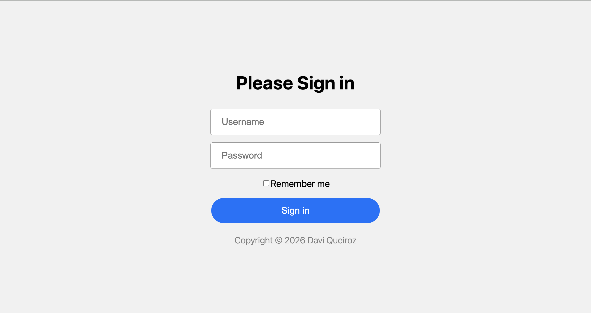
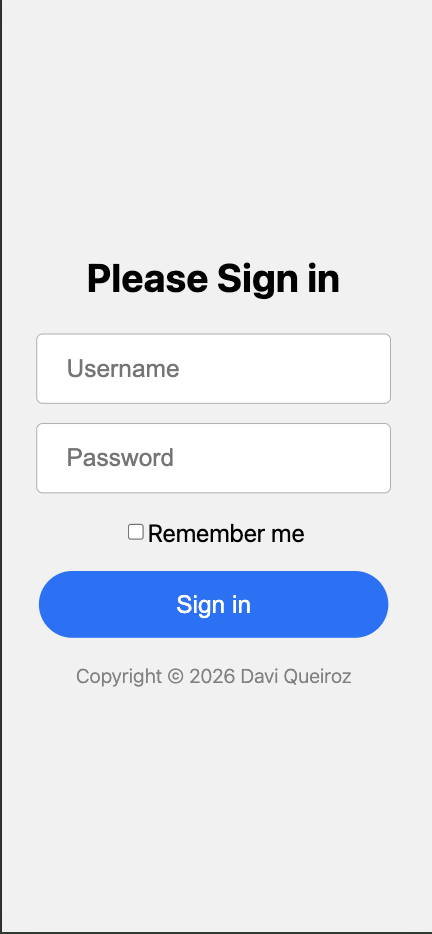

# 🧑‍💻 Responsive Login Page (July 10th-11th 2026)
A simple responsive login page built while working through the Forms section of Mosh’s HTML & CSS course.
After spending the week at school and finally getting some uninterrupted coding time on the weekend, I wanted to take what I learned and build the project myself instead of just following along. I also took the opportunity to style it in my own way, make it fully responsive with media queries, and practice using Git with small, clean commits throughout the process.
Nothing too crazy, just another step toward becoming more comfortable with front-end development.

---
## Preview 📷

### Project Link:

https://davi-sousa-queiroz.github.io/responsive-login-page/

---

## Features
	●	Responsive layout
	●	Custom styling
	●	Input focus effects
	●	Button hover effects
	●	Mobile-friendly design
	●	Clean Git commit history

## “Small projects. Small improvements. Keep shipping.” 🚀
